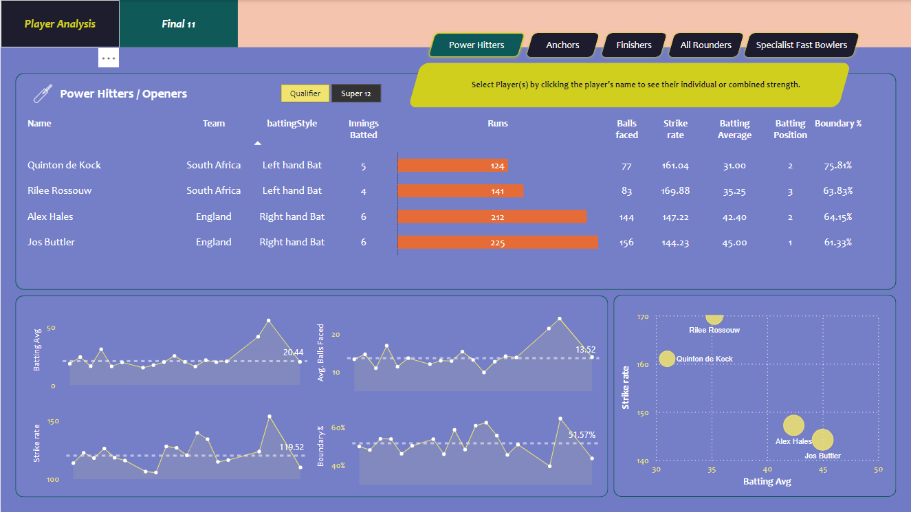

# T20 World Cup Cricket Data Analytics

## Overview
This project leverages data from the T20 World Cup 2022 to build insights and assemble the best possible cricket team. A comprehensive Power BI dashboard was created to analyze player performance metrics, helping identify top-performing players in key roles. The goal was to optimize team selection and enhance the winning probability to 90%.
---
**Dataset Details** : [CodeBasics](https://codebasics.io/challenge/codebasics-resume-project-challenge)

The analysis is based on the following CSV files:
- dim_players: Deatils about the players
- dim_match_summary: Deatils about the match with outcome.
- fact_bating_summary: Detailes batting performance of batters.
- fact_bowling_summary: Detailes bowling performance of bowlers.
---
**Key Insights**
- Player Categorization: Classification of players into key roles:
  - Openers
  - Middle Order
  - Finishers
  - All-Rounders
  - Fast Bowlers
- Performance Insights: Analyze success rates based on batting, bowling, and fielding metrics.
- Team Selection: Assembled a "Best XI Players" team using data-driven analysis.
- Winning Probability: Strategies to maximize team performance and increase the winning probability to 90%.
---
## Power BI - Dashboard

---
**Reference**
- https://codebasics.io/resources/data-analytics-project-for-beginners
